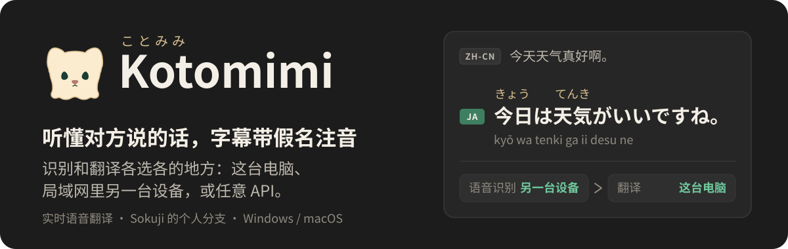
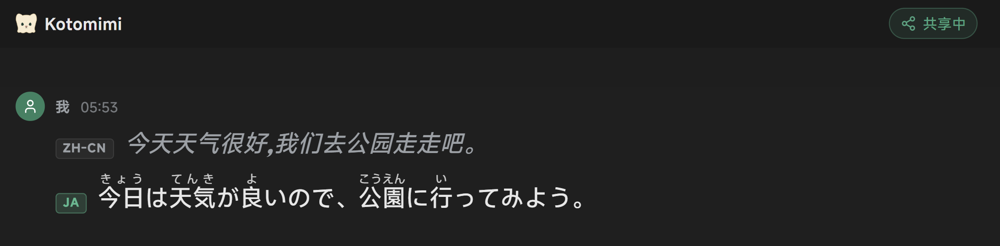
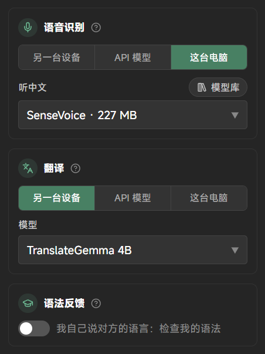
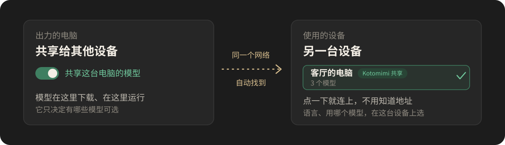

  

  <a href="https://github.com/Rizumu85/kotomimi/releases/latest"><b>下载最新版</b></a>
  · <a href="#三步上手">三步上手</a>
  · <a href="#两台设备一起用">两台设备一起用</a>
  · <a href="#english">English</a>

  

## 这是什么

Kotomimi（ことみみ）是一个实时语音翻译应用：你或对方开口说话，屏幕上马上出现原文和译文。它是 [Sokuji](https://github.com/kizuna-ai-lab/sokuji) 的个人分支，为"跟日本人聊天、顺便学日语"这件事加了几样东西：

- **读得懂的字幕**：日语汉字上方标假名，日语、韩语、俄语下面可以加一行罗马音。
- **自己决定模型在哪运行**：语音识别、翻译、语法反馈是三个环节，各自可以在这台电脑、局域网里另一台设备、或任意 API 上运行，随便混搭。
- **两台设备一起用**：一台电脑出力，另一台设备直接用它的模型。
- **打字也能翻**：会话中按 `Ctrl+K`，打一句母语，得到对方语言的译文。
- **语法反馈**：自己说对方的语言时，会告诉你这句话说得对不对、该怎么改。
- **丰富的字体自定义**：界面、拉丁字母、每种语言的正文和注音，分别选电脑上装的字体。

Sokuji 原有的功能和云服务提供商（OpenAI、Gemini、Soniox 等）都还在。

## 三步上手

1. **下载安装。** 到 [Releases](https://github.com/Rizumu85/kotomimi/releases/latest) 下载：

   - **Windows**：`Kotomimi-x.y.z.Setup.exe`。安装包没有代码签名，Windows 会提示"未知发布者"：点"更多信息"，再点"仍要运行"。
   - **macOS（Apple 芯片）**：`Kotomimi-x.y.z-arm64.dmg`。没有经过 Apple 公证：拖进"应用程序"后，第一次要右键点应用，选"打开"。

2. **跟着向导走。** 选界面语言、用途，然后选"Kotomimi 自由搭配"。接下来它会问由哪台设备来运行：
   - 只有这一台电脑：选"这台电脑"，向导结束后下载一个语音识别模型就能用。翻译默认用在线翻译，不用下载。
   - 家里另一台电脑已经在共享模型：选"局域网里的另一台设备"，它会自己搜出来，点一下就连上。
   - 这台电脑配置好，想让家里别的设备也用它的模型：选"这台电脑，也给其他设备用"。模型在这台电脑上运行，向导完成时自动打开共享。

3. **点"开始会话"，开口说话。**

不需要注册账号，也不需要 API 密钥。

## 每个环节各选各的

一句话从说出口到变成译文，要过语音识别和翻译两个环节；想练口语时，还可以打开语法反馈。设置里每个环节一张卡片，都有同样的三个去处，用哪个模型也在同一张卡片里选：

  

| 去处 | 是什么 | 适合 |
|---|---|---|
| **另一台设备** | 局域网里开了共享的 Kotomimi，或 LocalAI 这类模型服务器 | 这台电脑配置一般，家里有台更好的 |
| **API 模型** | 任何 OpenAI 兼容的接口：识别用 `/v1/audio/transcriptions`，翻译和语法反馈用 `/v1/chat/completions` | 想用云端的大模型 |
| **这台电脑** | 应用自己下载的模型，模型库就在卡片里，可以完全离线 | 不想依赖别的设备和网络 |

各个环节可以选不同的去处。比如上图：这台电脑负责听，翻译交给另一台设备上的模型。

## 两台设备一起用

  

1. 在**出力的电脑**上：打开设置，切到高级布局，在"提供商"页最下面打开"共享这台电脑的模型"。卡片上会显示这台电脑在对方列表里的名字。
2. 在**另一台设备**上：在设置的"另一台设备"一栏里点搜索，应用会把局域网里找到的设备列出来，点一下就连上；然后在想交给它的环节卡片里选"另一台设备"。

要点：

- 两台设备要连着同一个 Wi-Fi 或路由器，出力的电脑上应用要开着。
- Windows 防火墙挡住时，共享卡片里会出现黄色提示和一个"允许"按钮，点它，再在 Windows 的确认窗口里点"是"。
- 语言、用哪个模型、断句灵敏度，在**使用的那台设备**上设置。出力的电脑只决定有哪些模型可选，对方选了哪个，它才加载哪个。
- 搜不到时（比如改过端口），可以手动填卡片上显示的地址。

## 还有这些

<b>这台电脑上装了 LocalAI</b>

 

有些模型不归应用自己运行，比如 Apple 的语音识别、MLX 模型、GGUF 翻译模型。它们可以由同一台电脑上的 [LocalAI](https://localai.io) 来跑。电脑上装了 LocalAI 时，设置里会多一节"这台电脑上的 LocalAI"：

- 启动和停止由 Kotomimi 来做，可以设成随应用启动，应用退出时一起停。
- 它只在这台电脑上监听，不对局域网开自己的端口。别的设备只能通过 Kotomimi 的共享用到它的模型。
- 打开共享后，它的模型和应用自己下载的模型一起共享出去：同一个开关、同一个地址，别的设备在自己的环节卡片里就能选到。
- 不会把所有模型都加载起来：对方选了哪个才加载哪个；换下来的识别模型如果没人在用就立即卸载，其余模型空闲 10 分钟后自动卸载。
- 这台电脑自己也能用它的模型：某个环节选"这台电脑"时，模型下拉里多一项"LocalAI"，选了它，下面就能挑 LocalAI 里的模型。
- 可以选别的设备没指定模型时用哪个识别模型、哪个翻译模型。
- 安装和删除模型仍然在 LocalAI 自己的页面里做，卡片上有链接。

没装 LocalAI 的电脑看不到这些，不影响任何别的功能。

<b>阅读辅助和字体</b>

 

- **假名注音和罗马音**在对话区右上角的显示设置里开关。注音在本机用词典和规则算出来，不调用任何模型，也不联网。
- **字体**在设置的"字体"里选：界面字体、拉丁字母和罗马音的字体，以及每种语言的正文字体和注音字体。拉丁字体只作用于拉丁字母和数字，不会盖掉中文、日文的字体。

<b>已经知道的限制</b>

 

- "Kotomimi 自由搭配"只出文字，不合成语音。需要语音输出时，用 Sokuji 原有的提供商。
- 内置的 SenseVoice 模型识别日语时会漏掉假名。日语建议用 Whisper，或在"自定义模型"里添加 `onnx-community/kotoba-whisper-v2.2-ONNX`。
- 识别走 API 时，文字要等一句话说完才出现，没有逐字更新。
- macOS 版只有 Apple 芯片的构建，而且不能自动更新，新版本要手动下载。
- 这是个人分支，更新节奏和功能取舍以自用为准。

## 想了解细节

- [FORK.md](FORK.md)：这个分支加了什么、各环节怎么搭配、和服务器之间的约定、怎么构建和发布。
- 遇到问题：[提交 issue](https://github.com/Rizumu85/kotomimi/issues)。请不要去打扰 Sokuji 官方，这个分支的问题不是他们的。

## 致谢与许可

Kotomimi 建立在 [Kizuna AI Lab](https://github.com/kizuna-ai-lab) 的 [Sokuji](https://github.com/kizuna-ai-lab/sokuji) 之上，绝大部分代码是他们的工作。本仓库沿用同一份许可：[AGPL-3.0](LICENSE)。各模型和依赖的许可见 [THIRD_PARTY_NOTICES.md](THIRD_PARTY_NOTICES.md)。

---

## English

Kotomimi is a personal fork of [Sokuji](https://github.com/kizuna-ai-lab/sokuji), a live speech translation app. It adds what its author wanted for talking with Japanese speakers while learning the language:

- **Subtitles you can read**: furigana over Japanese kanji, and an optional romanization line under Japanese, Korean and Russian.
- **Stages you place yourself**: speech recognition, translation and grammar feedback each run on this computer, on another device on your network, or on any OpenAI-compatible API, in any mix.
- **Two devices together**: one computer shares the models it has downloaded; another device finds it on the network and uses them, downloading nothing.
- **Typed lookups** (`Ctrl+K`), **grammar feedback** on your own speech, and **fonts** chosen per language.

**Install**: download from [Releases](https://github.com/Rizumu85/kotomimi/releases/latest). The Windows installer is not code-signed, so Windows warns about an unknown publisher; the macOS build (Apple silicon) is not notarized, so right-click the app and choose Open the first time. Then follow the setup wizard and pick "Kotomimi Pipeline". No account and no API key are needed.

**Limits**: the Kotomimi provider is text-only; the built-in SenseVoice model drops kana in Japanese (use Whisper); recognition through an API shows text only when a sentence ends.

Everything else — how the stages combine, the wire contract, building and releasing — is in [FORK.md](FORK.md) (Chinese). Sokuji is the work of [Kizuna AI Lab](https://github.com/kizuna-ai-lab); this fork keeps its license, [AGPL-3.0](LICENSE). Please report this fork's problems [here](https://github.com/Rizumu85/kotomimi/issues), not upstream.
